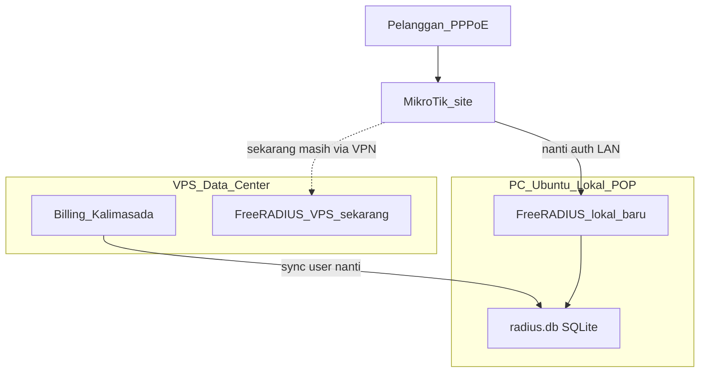

# Plan: FreeRADIUS Lokal POP (untuk agent di server lokal)

Dokumen ini untuk dijalankan / dijelaskan di **Cursor agent pada PC Ubuntu lokal (POP)**.  
Billing aplikasi tetap di **VPS data center**. Tujuan: auth PPPoE dekat MikroTik agar VPN timeout tidak memutus pelanggan massal.

## Konteks arsitektur



**Prinsip:** VPN hanya untuk sync/admin. Auth PPPoE harus ke IP LAN FreeRADIUS lokal.

## Batasan WAJIB (agent lokal harus patuh)

1. **Jangan** ubah `/radius` atau PPPoE di MikroTik produksi sekarang.
2. **Jangan** uji putus VPN / matikan tunnel ke VPS.
3. **Jangan** `radtest` massal yang mengganggu sesi hidup.
4. Yang boleh sekarang: install FreeRADIUS di PC lokal, daftarkan NAS, verifikasi service, siapkan sync user.
5. Radius Manager di portal = inventaris saja; **bukan** yang menentukan IP di MikroTik.

## File install (sudah ada di repo VPS)

Path di repo Kalimasada:

- `scripts/install-freeradius-local-pop.sh` — **mandiri**, satu file, cukup di-copy ke PC lokal.

Salin dari VPS ke PC lokal (contoh):

```bash
# dari PC lokal / WinSCP / scp:
scp root@VPS:/root/Saas-Kalimasada_Inti_Sarana/scripts/install-freeradius-local-pop.sh .
chmod +x install-freeradius-local-pop.sh
```

## Fase A — Install di PC Ubuntu lokal (SEKARANG)

### A1. Jalankan install

Ganti nilai sesuai site:

```bash
sudo bash install-freeradius-local-pop.sh \
  --pop-name "POP-BNA1" \
  --nas-ip <IP_LAN_MIKROTIK> \
  --nas-secret '<SECRET_SAMA_NANTI_DI_MIKROTIK>' \
  --billing-host 10.10.0.1
```

Default mode: **sqlite**, DB: `/var/lib/freeradius/radius.db`.

Tanpa argumen juga bisa (interaktif):

```bash
sudo bash install-freeradius-local-pop.sh
```

### A2. Verifikasi (read-only setelah install)

```bash
systemctl status freeradius
sudo freeradius -C
ls -la /var/lib/freeradius/radius.db
sqlite3 /var/lib/freeradius/radius.db "SELECT COUNT(*) FROM radcheck; SELECT nasname,shortname FROM nas;"
grep -A5 "ipaddr = <IP_LAN_MIKROTIK>" /etc/freeradius/3.0/clients.conf
hostname -I
cat /etc/freeradius/billing-pop/pop-info.env
```

Catat **IP LAN** PC ini — itu yang nanti diisi di MikroTik `/radius` (bukan IP portal).

### A3. Daftarkan di Radius Manager (portal)

URL: https://manage.kalimasada-app.com/management/pop/radius

| Field | Isi |
|-------|-----|
| POP | POP site ini (mis. POP-BNA1) |
| Host | IP yang **VPS bisa pantau** (sering IP tunnel PC lokal) |
| Auth / Acct | 1812 / 1813 |
| Secret | sama `--nas-secret` |
| Status | Aktif |

Jika sebelumnya ada stub `192.0.2.1` nonaktif di POP-BNA1: edit jadi IP nyata + aktifkan.

## Fase B — Sync user (mendekati realtime)

Aktif (auth MikroTik ke FreeRADIUS **POP**):

| Sisi | Jadwal | Skrip |
|------|--------|--------|
| VPS (utama) | **segera** setelah ubah user/profil di billing | hook `utils/radiusPopSync.js` → `radius-pop-sync-publish.sh` → apply SSH di POP |
| VPS (cadangan) | tiap **1 menit** | `scripts/radius-pop-sync-publish.sh` |
| POP (cadangan) | tiap **1 menit** | `~/radius-sync/radius-pop-sync-apply.sh` |

- Push hanya jika `radius.db` VPS berubah (mtime/size) + SHA konten beda → hemat CPU/IO.
- Setelah push, VPS **langsung** menjalankan apply di POP (tidak menunggu cron).
- Payload ~0.5 MB (tabel user saja), tanpa stop FreeRADIUS.
- Log VPS: `/var/log/kalimasada-radius-pop-sync.log`
- Log POP: `~/radius-sync/apply.log`

Setelah ganti profil/isolir di billing: sync biasanya **beberapa detik**, lalu **kick/reconnect** PPPoE agar auth baru memakai group terbaru di RADIUS POP.

## Fase C — Cutover MikroTik (DITUNDA — jangan sekarang)

Baru setelah: FreeRADIUS lokal OK + user tersync + jadwal jam sepi.

```
/export file=backup-before-radius-local
/radius add name=RADIUS-LOCAL address=<IP_LAN_PC_FREERADIUS> secret=<SECRET> service=ppp authentication-port=1812 accounting-port=1813 timeout=3s
/interface pppoe-server server set [find] authentication=radius
```

Opsional cadangan VPS:

```
/radius add name=RADIUS-VPS address=10.10.0.1 secret=<SECRET_NAS> service=ppp timeout=3s
```

**IP di MikroTik = IP LAN FreeRADIUS lokal**, bukan URL portal, bukan `127.0.0.1` VPS.

## Fase D — Uji (DITUNDA)

1. Login 1–2 pelanggan → `Access-Accept` di log lokal  
2. Isolir 1 user dari billing → sync → reconnect  
3. Baru uji putus VPN (target: PPPoE tetap hidup dari RADIUS lokal)

## Ringkas tugas agent di server lokal

| Lakukan sekarang | Jangan lakukan sekarang |
|------------------|-------------------------|
| Install via `install-freeradius-local-pop.sh` | Ubah MikroTik `/radius` produksi |
| Verifikasi freeradius + NAS + DB | Putus VPN / uji mass disconnect |
| Catat IP LAN + secret | Matikan FreeRADIUS VPS |
| Siapkan/jalankan sync user dari VPS | Cutover semua site sekaligus |
| Ingatkan admin daftar di Radius Manager | |

## Referensi di repo VPS (jika agent punya akses clone)

- `scripts/install-freeradius-local-pop.sh` — installer mandiri
- `scripts/install-freeradius-billing.sh` — installer lengkap (butuh template repo)
- `docs/RADIUS_MANAGER_PREP.md` — status inventaris VPS + checklist MikroTik
- `scripts/verify-radius-manager-prep.sh` — verifikasi di sisi VPS (bukan wajib di POP)

## Prompt singkat untuk agent lokal

Salin ini ke chat Cursor di server lokal:

> Ikuti plan FreeRADIUS Lokal POP. Install FreeRADIUS di Ubuntu ini dengan `install-freeradius-local-pop.sh` (sqlite). Daftarkan NAS MikroTik. Verifikasi service + DB. Jangan ubah MikroTik produksi dan jangan uji putus VPN. Setelah install, bantu sync user dari VPS billing (`radcheck` dkk) ke `/var/lib/freeradius/radius.db` lokal. Laporkan IP LAN, secret, dan status service.

## Username PPPoE dengan `@` (literal)

Pin config FreeRADIUS agar `user@site` tidak ditolak/potong realm — lihat `docs/RADIUS_MODE_README.md`.

Di POP yang sudah jalan (satu kali, butuh sudo):

```bash
sudo bash ~/radius-sync/freeradius-pin-literal-at.sh
```

Verifikasi: `radtest 'user@site' PASS 127.0.0.1 0 testing123` → Access-Accept.

**Catatan:** sync dump SQL user dari VPS **tidak** menyalin pin ini; config harus di-apply di setiap host FreeRADIUS. Installer lokal memanggil pin otomatis jika `scripts/lib/freeradius-pin-literal-at.sh` tersedia.
